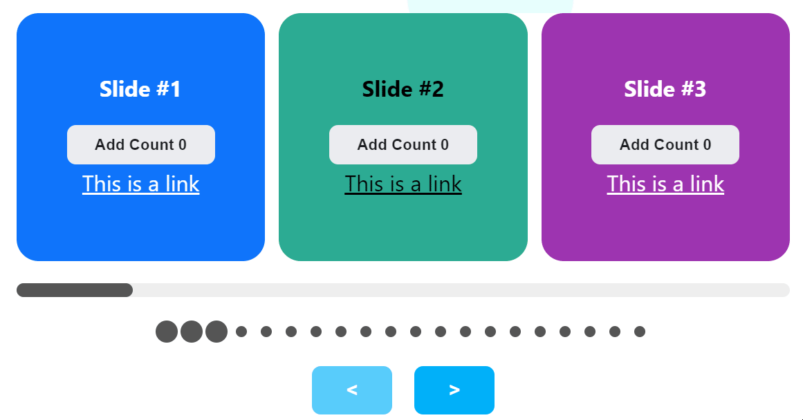

<div align="center"></div>

<h1 align="center">React Scroll Snap Anime Slider</h1>

<div align="center">
  
A simple slider/carousel using css style [scroll-snap](https://developer.mozilla.org/en-US/docs/Web/CSS/CSS_Scroll_Snap) and [Popmotion](https://popmotion.io/)

Works natively on touchable devices

[](https://github.com/karanokara/react-scroll-snap-anime-slider/blob/master/LICENSE)

[](https://www.npmjs.com/package/react-scroll-snap-anime-slider)

<div align="center"></div>

<br/>

:grinning:[Demo](https://karanokara.github.io/react-scroll-snap-anime-slider/)

</div>

<br/>

## :star: Features 

| Features                             |                                                                             Comment                                                                             |       Status        |
| ------------------------------------ | :-------------------------------------------------------------------------------------------------------------------------------------------------------------: | :-----------------: |
| **Multiple slides per view**         |                                                               Can adjust multiple slides per step                                                               | :heavy_check_mark:  |
| **Customized DOM structure**         |                                                           Construct the slider components by yourself                                                           | :heavy_check_mark:  |
| **Customized slides margin**         |                                                                    Margin between each slide                                                                    | :heavy_check_mark:  |
| **Customized slide tray padding**    |                                                            Offset slide tray to see prev/next slide                                                             | :heavy_check_mark:  |
| **Touch scrolling**                  |                                                                            Built-in                                                                             | :heavy_check_mark:  |
| **Scroll and snap**                  |                                                                      Snap to slide's edge                                                                       | :heavy_check_mark:  |
| **Free scrolling**                   |                                                                                                                                                                 | :heavy_check_mark:  |
| **Scroll with touch pad**            |                                                                            Built-in                                                                             | :heavy_check_mark:  |
| **Scroll with keyboard < and >**     |                                                                            Built-in                                                                             | :heavy_check_mark:  |
| **Scroll with mouse drag**           |                                                                 Scroll end with inheria effect                                                                  | :heavy_check_mark:  |
| **Scroll with mouse wheel**          |                                                                                                                                                                 |         :x:         |
| **Navigation Buttons**               |                                                                     Support multiple clicks                                                                     | :heavy_check_mark:  |
| **Dynamic scrollbar**                |                                                                                                                                                                 | :heavy_check_mark:  |
| **Dynamic & Customizable dot group** | Customize using [`renderDots()`](https://karanokara.github.io/react-scroll-snap-anime-slider/docs/component-api/slider-bar-dot-group#irenderdotsprops) callback | :heavy_check_mark:  |
| **Bounce on boundary**               |                                                                  Built-in on touchable devices                                                                  | :large_blue_circle: |
| **Responsive style**                 |                                                                            Built-in                                                                             | :heavy_check_mark:  |
| **Customized Style**                 |                                                         Use class-name or style to override basic style                                                         | :heavy_check_mark:  |
| **Inifinite scrolling**              |                                                                                                                                                                 |         :x:         |
| **Auto play**                        |              Can implement it by using [Slider ref](https://karanokara.github.io/react-scroll-snap-anime-slider/docs/example-usage/auto-scrolling)              |         :x:         |
| **Vertical scrolling**               |                                                                             Pending                                                                             |      :clock3:       |

<br/>

## :neutral_face: Motivation 
The reason to start creating my own JS slider is because I couldn't find a slider that works smoothly on both desktop browser and mobile device. There are a ton of wonderfull sliders out there such as [Swiper](https://swiperjs.com/), [Pure React Carousel](https://express-labs.github.io/pure-react-carousel/) and a lot, but they are not utilizing the native scrolling feature, and so not work natively on iOS browser (the animation not works smoothly). 

<br/>

## 🤔 Do I need this slider?
If you are looking for an animation effect of slider that works like those sliders you saw in some native Apps, you can try this one. However this slider has limitions such as it only provides sliding effect (no fade, swiping effects, for example). So, if you are looking for a powerful slider, you should other powerful library such as [Swiper](https://swiperjs.com/).

<br/>

## :pushpin: Geting started

### Install:
```bash
npm install react-scroll-snap-anime-slider
```

### Create a simple slider:
```js
import { ButtonBack, ButtonNext, Carousel, Slide, Slider, SliderBarLine } from "react-scroll-snap-anime-slider";

export function MySlider() {
    let total = 20;
    let visible = 3;
    let step = 3;

    return (
        <Carousel
            totalSlides={total}
            visibleSlides={visible}
            step={step}
        >
            <Slider>
                {new Array(total).fill(0).map((_, i) => {
                    return <Slide key={i}>
                        <div style={{ height: "100px", border: "1px solid #ccc", textAlign: "center" }}>slider# {i}</div>
                    </Slide>;
                })}
            </Slider>

            <SliderBarLine />

            <div style={{ textAlign: "center" }}>
                <ButtonBack>&lt;</ButtonBack>
                <ButtonNext>&gt;</ButtonNext>
            </div>

        </Carousel>
    );
}
```

<br/>

## :book: Documentation
You can learn more from [here](https://karanokara.github.io/react-scroll-snap-anime-slider/).


<br/>

## :bug: Bugs or :bow: Requests 
You can file an issue under the [Issues](../../issues) page.
